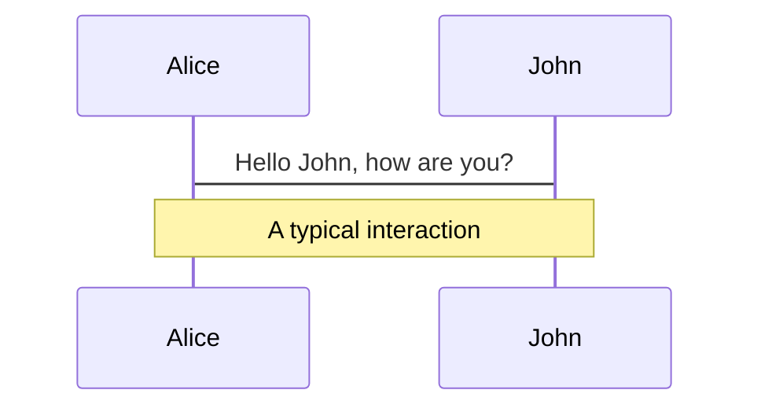
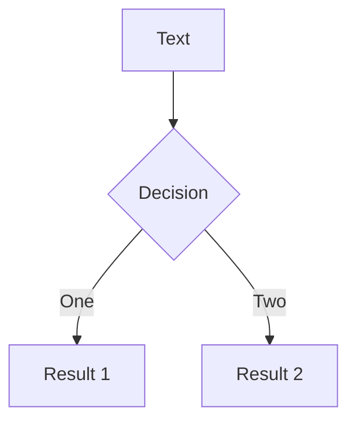
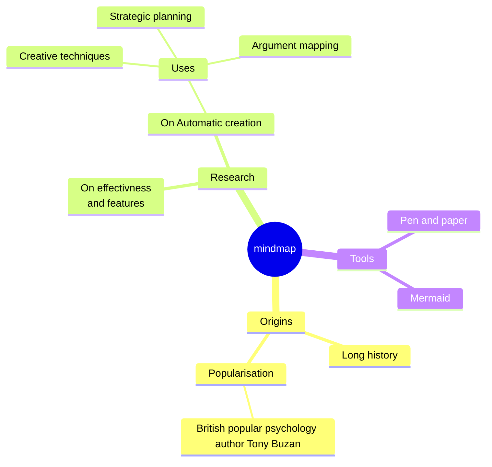
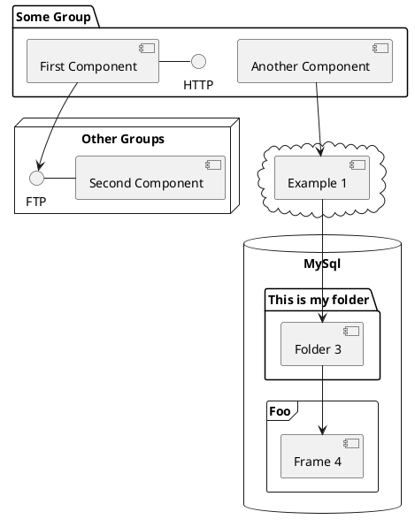

---
# try also 'default' to start simple
theme: dracula
# random image from a curated Unsplash collection by Anthony
# like them? see https://unsplash.com/collections/94734566/slidev
background: https://cover.sli.dev
# some information about your slides, markdown enabled
title: Carver Automation
info: |
  ## Carver Automation Pitch Book
  AI-Driven Chat Analytics for Business Intelligence

  Learn more at [threadr.ai](https://staging.threadr.ai)
# apply any unocss classes to the current slide
class: text-center
# https://sli.dev/custom/highlighters.html
highlighter: shiki
# https://sli.dev/guide/drawing
drawings:
  persist: false
# slide transition: https://sli.dev/guide/animations#slide-transitions
transition: slide-left
# enable MDC Syntax: https://sli.dev/guide/syntax#mdc-syntax
mdc: true
---

# Carver Automation, LLC

Illuminating Chat Dynamics: Harnessing AI to Decode Communication Patterns


<div class="abs-br m-6 flex gap-2">
  <button @click="$slidev.nav.openInEditor()" title="Open in Editor" class="text-xl slidev-icon-btn opacity-50 !border-none !hover:text-white">
    <carbon:edit />
  </button>
  <a href="https://github.com/carverauto/threadr-pitch" target="_blank" alt="GitHub" title="Open in GitHub"
    class="text-xl slidev-icon-btn opacity-50 !border-none !hover:text-white">
    <carbon-logo-github />
  </a>
</div>

<!--
The last comment block of each slide will be treated as slide notes. It will be visible and editable in Presenter Mode along with the slide. [Read more in the docs](https://sli.dev/guide/syntax.html#notes)
-->

---
transition: fade-out
---

# The Growing Complexity of Digital Communications

In today's digital age, the landscape of communication is more varied and voluminous than ever before. With the proliferation of chat platforms like Slack, Discord, IRC, and Telegram, alongside traditional email exchanges, navigating and making sense of these vast data streams has become a formidable challenge. Organizations now face the daunting task of analyzing these communications effectively to foster collaboration, ensure compliance, and extract valuable insights. Moreover, the rapid evolution of language and communication patterns, accelerated by AI technologies, demands solutions that are not only comprehensive but also adaptable to the shifting dynamics of digital discourse.

<!--
You can have `style` tag in markdown to override the style for the current page.
Learn more: https://sli.dev/guide/syntax#embedded-styles
-->

<style>
h1 {
  background-color: #2B90B6;
  background-image: linear-gradient(45deg, #4EC5D4 10%, #146b8c 20%);
  background-size: 100%;
  -webkit-background-clip: text;
  -moz-background-clip: text;
  -webkit-text-fill-color: transparent;
  -moz-text-fill-color: transparent;
}
</style>

<!--
Here is another comment.
-->

---
transition: slide-up
level: 2
---

# Navigating the Complexities of Modern Digital Communication

The exponential growth in digital communication platforms has led to an overwhelming increase in the volume and variety of data. Organizations struggle to keep pace with the information flow, leading to potential oversights in compliance, security, and valuable insights.

With the rapid expansion of remote work and digital collaboration, there has been a significant rise in miscommunication and misinformation. This not only affects productivity but also poses risks to organizational integrity and reputation.

As digital communication continues to evolve, traditional analysis tools fall short. The dynamic nature of online discourse, including the use of slang, emojis, and shorthand, requires advanced solutions capable of understanding and adapting to new communication styles.

---
layoutClass: gap-16
---

# Introducing ThreadR: AI-Driven Communication Analysis

Carver Automation's ThreadR is engineered to tackle the complexities of managing and analyzing digital communications across multiple platforms. Leveraging the cutting-edge capabilities of Graph-RAG and fine-tuned Large Language Models, ThreadR offers a new paradigm in understanding and navigating digital discourse. Within moments, ThreadR can process vast amounts of chat data, identify patterns, assess relationships, and provide actionable insights.

Unlike conventional communication analysis tools that struggle with the scale and dynamism of modern digital interactions, ThreadR simplifies the process. It eliminates the need for extensive resource allocation and training, making advanced communication analysis accessible to organizations of all sizes. In an era marked by rapid technological advancements and the increasing importance of clear, secure digital communication, ThreadR stands as a beacon for businesses, educational institutions, and online communities.

By transcending traditional barriers, ThreadR empowers organizations to harness the full potential of their digital communications, ensuring compliance, enhancing security, and unlocking valuable insights hidden within their data.

---
layoutClass: gap-16
---

# Empowering Communication with ThreadR

ThreadR revolutionizes the way businesses and organizations manage and analyze their digital communications. By integrating ThreadR into their digital environments, teams gain access to a powerful, AI-driven platform that simplifies and enhances the understanding of complex communication networks.

With ThreadR, users can effortlessly navigate through vast amounts of data from various chat mediums, including Slack, Discord, IRC, and more, using both a natural language interface and an intuitive dashboard on mobile or web. This dual-access approach ensures that insights and analyses are readily available, whether for real-time decision-making or in-depth historical analysis.

---
layoutClass: gap-16
---

# Key features of ThreadR

* **Comprehensive Analysis**: From identifying key topics of discussion to uncovering hidden relationships within communication data, ThreadR provides a depth of analysis previously unattainable.
* **Real-time Insights**: ThreadR's AI-driven analysis engine processes data in real-time, providing actionable insights and alerts as they occur.
* **Efficient Information Retrieval**: Quickly find relevant discussions, decisions, and information exchanges, reducing the time spent searching through archives.
* **Enhanced Collaboration**: By understanding the dynamics and content of past and present conversations, teams can improve their communication strategies and collaboration efforts.


<!-- Footer -->
[^1]: [Learn More](https://sli.dev/guide/syntax.html#line-highlighting)

<!-- Inline style -->
<style>
.footnotes-sep {
  @apply mt-5 opacity-10;
}
.footnotes {
  @apply text-sm opacity-75;
}
.footnote-backref {
  display: none;
}
</style>

<!--
Notes can also sync with clicks

[click] This will be highlighted after the first click

[click] Highlighted with `count = ref(0)`

[click:3] Last click (skip two clicks)
-->

---
level: 2
---

# Shiki Magic Move

Powered by [shiki-magic-move](https://shiki-magic-move.netlify.app/), Slidev supports animations across multiple code snippets.

Add multiple code blocks and wrap them with <code>````md magic-move</code> (four backticks) to enable the magic move. For example:

````md magic-move
```ts {*|2|*}
// step 1
const author = reactive({
  name: 'John Doe',
  books: [
    'Vue 2 - Advanced Guide',
    'Vue 3 - Basic Guide',
    'Vue 4 - The Mystery'
  ]
})
```

```ts {*|1-2|3-4|3-4,8}
// step 2
export default {
  data() {
    return {
      author: {
        name: 'John Doe',
        books: [
          'Vue 2 - Advanced Guide',
          'Vue 3 - Basic Guide',
          'Vue 4 - The Mystery'
        ]
      }
    }
  }
}
```

```ts
// step 3
export default {
  data: () => ({
    author: {
      name: 'John Doe',
      books: [
        'Vue 2 - Advanced Guide',
        'Vue 3 - Basic Guide',
        'Vue 4 - The Mystery'
      ]
    }
  })
}
```

Non-code blocks are ignored.

```vue
<!-- step 4 -->
<script setup>
const author = {
  name: 'John Doe',
  books: [
    'Vue 2 - Advanced Guide',
    'Vue 3 - Basic Guide',
    'Vue 4 - The Mystery'
  ]
}
</script>
```
````

---

# Components

<div grid="~ cols-2 gap-4">
<div>

You can use Vue components directly inside your slides.

We have provided a few built-in components like `<Tweet/>` and `<Youtube/>` that you can use directly. And adding your custom components is also super easy.

```html
<Counter :count="10" />
```

<!-- ./components/Counter.vue -->
<Counter :count="10" m="t-4" />

Check out [the guides](https://sli.dev/builtin/components.html) for more.

</div>
<div>

```html
<Tweet id="1390115482657726468" />
```

<Tweet id="1390115482657726468" scale="0.65" />

</div>
</div>

<!--
Presenter note with **bold**, *italic*, and ~~striked~~ text.

Also, HTML elements are valid:
<div class="flex w-full">
  <span style="flex-grow: 1;">Left content</span>
  <span>Right content</span>
</div>
-->

---
class: px-20
---

# Themes

Slidev comes with powerful theming support. Themes can provide styles, layouts, components, or even configurations for tools. Switching between themes by just **one edit** in your frontmatter:

<div grid="~ cols-2 gap-2" m="t-2">

```yaml
---
theme: default
---
```

```yaml
---
theme: seriph
---
```


</div>

Read more about [How to use a theme](https://sli.dev/themes/use.html) and
check out the [Awesome Themes Gallery](https://sli.dev/themes/gallery.html).

---

# Clicks Animations

You can add `v-click` to elements to add a click animation.

<div v-click>

This shows up when you click the slide:

```html
<div v-click>This shows up when you click the slide.</div>
```

</div>

<br>

<v-click>

The <span v-mark.red="3"><code>v-mark</code> directive</span>
also allows you to add
<span v-mark.circle.orange="4">inline marks</span>
, powered by [Rough Notation](https://roughnotation.com/):

```html
<span v-mark.underline.orange>inline markers</span>
```

</v-click>

<div mt-20 v-click>

[Learn More](https://sli.dev/guide/animations#click-animations)

</div>

---
preload: false
---

# Motions

Motion animations are powered by [@vueuse/motion](https://motion.vueuse.org/), triggered by `v-motion` directive.

```html
<div
  v-motion
  :initial="{ x: -80 }"
  :enter="{ x: 0 }">
  Slidev
</div>
```

<div class="w-60 relative mt-6">
  <div class="relative w-40 h-40">
    
    
    
  </div>

  <div
    class="text-5xl absolute top-14 left-40 text-[#2B90B6] -z-1"
    v-motion
    :initial="{ x: -80, opacity: 0}"
    :enter="{ x: 0, opacity: 1, transition: { delay: 2000, duration: 1000 } }">
    Slidev
  </div>
</div>

<!-- vue script setup scripts can be directly used in markdown, and will only affects current page -->
<script setup lang="ts">
const final = {
  x: 0,
  y: 0,
  rotate: 0,
  scale: 1,
  transition: {
    type: 'spring',
    damping: 10,
    stiffness: 20,
    mass: 2
  }
}
</script>

<div
  v-motion
  :initial="{ x:35, y: 40, opacity: 0}"
  :enter="{ y: 0, opacity: 1, transition: { delay: 3500 } }">

[Learn More](https://sli.dev/guide/animations.html#motion)

</div>

---

# LaTeX

LaTeX is supported out-of-box powered by [KaTeX](https://katex.org/).

<br>

Inline $\sqrt{3x-1}+(1+x)^2$

Block
$$ {1|3|all}
\begin{array}{c}

\nabla \times \vec{\mathbf{B}} -\, \frac1c\, \frac{\partial\vec{\mathbf{E}}}{\partial t} &
= \frac{4\pi}{c}\vec{\mathbf{j}}    \nabla \cdot \vec{\mathbf{E}} & = 4 \pi \rho \\

\nabla \times \vec{\mathbf{E}}\, +\, \frac1c\, \frac{\partial\vec{\mathbf{B}}}{\partial t} & = \vec{\mathbf{0}} \\

\nabla \cdot \vec{\mathbf{B}} & = 0

\end{array}
$$

<br>

[Learn more](https://sli.dev/guide/syntax#latex)

---

# Diagrams

You can create diagrams / graphs from textual descriptions, directly in your Markdown.

<div class="grid grid-cols-4 gap-5 pt-4 -mb-6">









</div>

[Learn More](https://sli.dev/guide/syntax.html#diagrams)

---
src: ./pages/multiple-entries.md
hide: false
---

---

# Monaco Editor

Slidev provides built-in Moanco Editor support.

Add `{monaco}` to the code block to turn it into an editor:

```ts {monaco}
import { ref } from 'vue'
import hello from './external'

const code = ref('const a = 1')
hello()
```

Use `{monaco-run}` to create an editor that can execute the code directly in the slide:

```ts {monaco-run}
function fibonacci(n: number): number {
  return n <= 1
    ? n
    : fibonacci(n - 1) + fibonacci(n - 2) // you know, this is NOT the best way to do it :P
}

console.log(Array.from({ length: 10 }, (_, i) => fibonacci(i + 1)))
```

---
layout: center
class: text-center
---

# Learn More

[Documentations](https://sli.dev) · [GitHub](https://github.com/slidevjs/slidev) · [Showcases](https://sli.dev/showcases.html)
